> **Example Account**\
> E-Mail: julian.htwg@example.com\
> Password: Htwg123

# Shelf Guardian

## Description

Introducing **Shelf Guardian**, your ultimate solution for managing product durability and inventory efficiently. With Shelf Guardian, you can ensure that your products are always fresh and well-managed. Here's what Shelf Guardian offers:

- **Track Minimum Durability Dates**: Monitor your products' expiration dates effortlessly. Shelf Guardian keeps an updated record of all your products' minimum durability dates.
- **Comprehensive Inventory Management**: Easily add, remove, or update product information. Maintain a well-organized and current inventory with just a few clicks.
- **Barcode Recognition**: Speed up your inventory process with our barcode scanning feature. Instantly add products to your inventory by scanning their barcodes.
- **Smart Notifications**: Stay informed with timely notifications on your phone when products are nearing their minimum durability dates. Prevent waste and ensure your products are always fresh.

**Shelf Guardian** – safeguarding your shelves and keeping your products fresh and organized!

## Features

### User-based Product Management with Authentication

Products are assigned to users, so before anyone can add products, they must create an account and sign in.

- **Sign In Page**: This is the start page when someone opens the app for the first time or if no valid authentication token is stored. Authentication tokens are invalidated once they expire.

  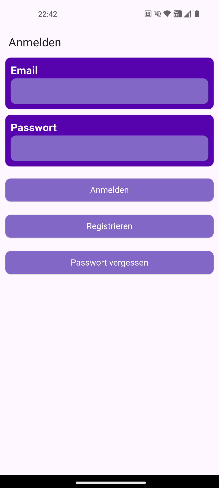

- **Sign Up Page**: Accessible when the user clicks on "Registrieren." Here, users can create an account, but they must verify it through a verification email from Supabase before using the app.
 
  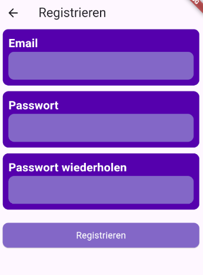

- **Forgot Password Page**: If a user forgets their password, they can recover their account. Supabase will send a recovery email allowing the user to reset their password.
  
  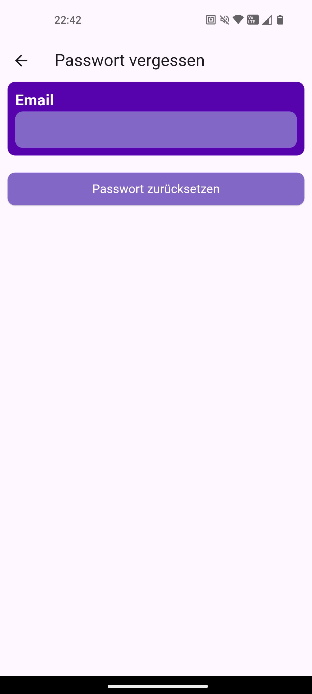

### Manage Products

#### Overview of Your Products

If you have a valid session, you can view your products. The start page displays all your products, sorted by their expiration dates, with those expiring soonest at the top. If no products are listed, you will see `Keine Produkte gefunden`.

You can select one or multiple products from the list to remove. To select a product, long-click on it. Once selected, you can add or remove other products with a short click. Alternatively, use the checkboxes next to each item to select or deselect them with a short click. Selected items will have a checked box, while unselected items will have an empty checkbox.

When a product is selected, the action buttons change. The main button in the center becomes the delete button for the selected items. The button on the right allows you to deselect items. If no items are selected, the main button adds a new product, and the right button selects all products.

<table>
  <thead>
    <tr>
      <th>Nothing Selected</th>
      <th>Something Selected</th>
    </tr>
  </thead>
  <tbody>
    <tr>
      <td>
        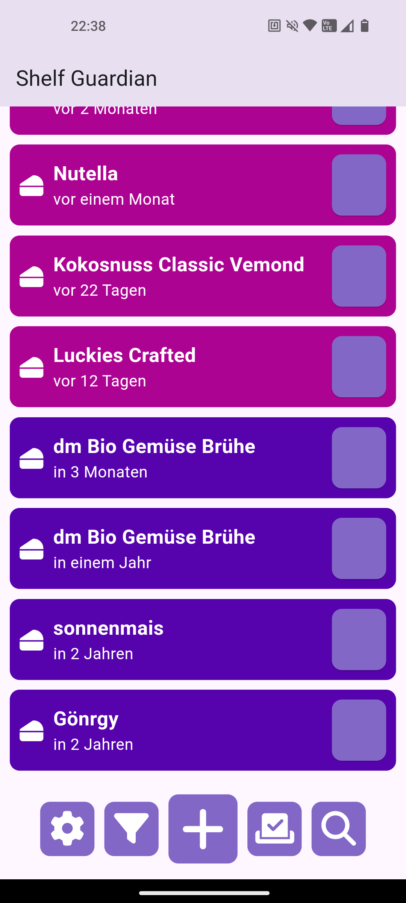
      </td>
      <td>
        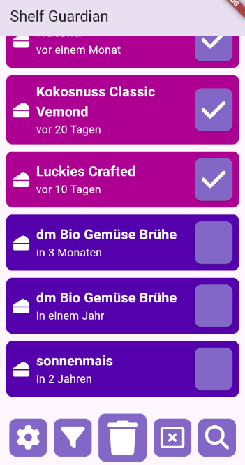
      </td>
    </tr>
</table>

#### Add a New Product

To add a new product, click the `+` button in the bottom right corner. This takes you to the `Scanner` page, where you can scan the product's barcode. If the barcode is not recognized, you can manually enter the product information. If recognized, the product information is filled in automatically, and you only need to enter the minimum durability date.

> Recognized barcodes mean the product is already in the database with its name filled in. If the barcode is not recognized, you must enter the name manually. The minimum durability date and price must be entered manually each time.

After scanning, you are taken to the `Create` page to enter the minimum durability date. Once all information is entered, click the save button to save the product. To cancel, click the cancel button or scan another barcode.

Once saved, you are redirected back to the `Home` page, where your new product appears in the list. If you have another device with the same account, the new product will be synchronized to it via Supabase Realtime Database.

<table>
  <thead>
    <tr>
      <th>Scanner Page</th>
      <th>Create Page</th>
    </tr>
  </thead>
  <tbody>
    <tr>
      <td>
        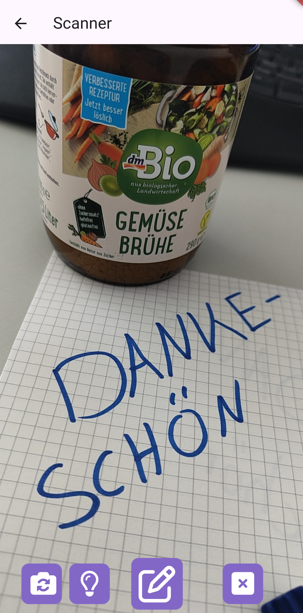
      </td>
      <td>
        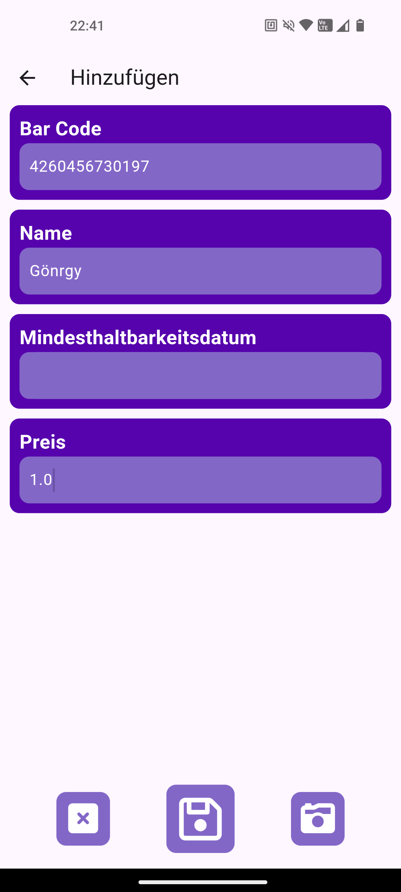
      </td>
    </tr>
</table>

#### Update a Product

To update a product, click on it in the list. This navigates to the `Update` page, where you can update the minimum durability date, name, price, and other details. After making changes, click the save button to save the product. To cancel, click the cancel button.

After saving, you are redirected back to the `Home` page, where the updated product appears in the list. Any device with the same account will receive the updated product.

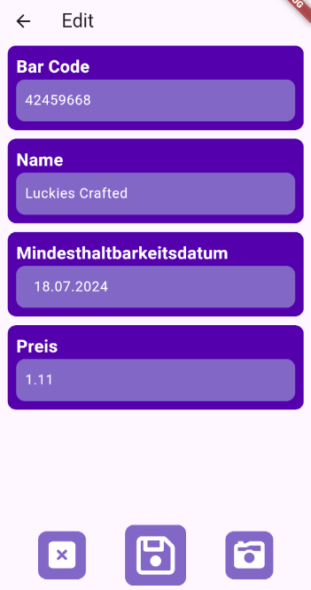

#### Delete a Product

To delete a product, select it from the list. This changes the action buttons, making the main button in the center the delete button for the selected items. Click the delete button to remove the selected products. To cancel, click the deselect button.

### Filter and Search Products

#### Filter Products

You can filter products using various criteria. The filter button, which is the second button in the action list on the `Home` page, opens the `Filter` page when clicked. On the `Filter` page, select your desired criteria and click the apply button (save icon) to filter the products. To cancel, click the cancel button or the back button.

The applied filter is saved in the local storage, so you don't need to reapply it every time you open the app. To remove the filter, click the filter button again and select the left button (filter with a x-icon).

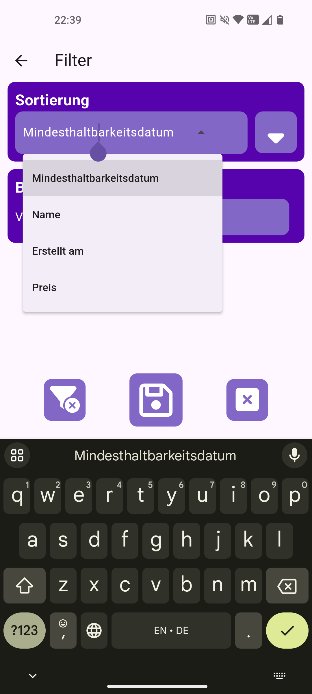

#### Search Products

If you have many products and need to find a specific one, you can use the search function. Click the last button in the action list, which has a magnifying glass icon, to open the `Search` bar. Enter the name of the product you are looking for. The search is case-insensitive and looks for the entered text within the product names. If the product is found, it will be highlighted in the list. If not, a message will display stating that no product was found.

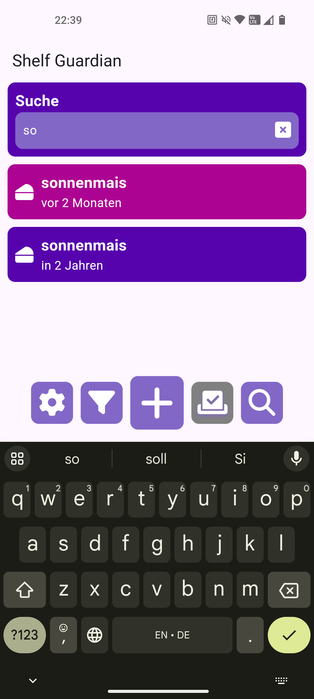

### Recognize Existing Barcode

When you scan a barcode, the app checks in the background to see if the barcode is already in the database. If it is, the product information will be automatically populated. If the barcode is not recognized, you will need to manually enter the product details, such as the name, description, and minimum durability date.

Additionally, if you update the name of a product, all products with the same barcode will be notified of the change. This ensures that any name update is applied universally to all products sharing that barcode, keeping your inventory consistent.

### Daily Notifications for Expiring Products

Shelf Guardian sends daily notifications to your device for products that are about to expire. These notifications are sent at 8:00 AM and will list all products expiring either on that day or the following day. If there are no products nearing expiration, no notification will be sent, ensuring you only receive relevant alerts.

### Real Time Synchronization

Shelf Guardian ensures real-time synchronization across all devices linked to the same account. Any changes made on one device, such as adding, updating, or deleting a product, are instantly reflected on all other devices. This allows you to seamlessly manage your inventory from multiple devices without worrying about data discrepancies.

### Easter Egg

For a fun surprise, scan the QR code below using the app's scanner. It will take you to the YouTube video [Rick Astley - Never Gonna Give You Up](https://www.youtube.com/watch?v=dQw4w9WgXcQ), playing the iconic song. This playful Easter egg is our way of adding a bit of fun to your experience with Shelf Guardian.

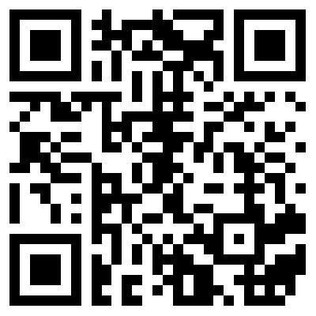

## Technologies

### State Management

For our states, we used the `bloc` package. This package allows us to manage the state of the app in a structured way. We created several blocs for the different pages and functionalities of the app. The blocs are responsible for managing the state of the app and updating the UI accordingly.

We separated our logic out into services to keep the blocs clean and focused on state management. The services handle the business logic of the app, such as fetching data from the backend, updating local storage, and sending notifications. This approach also allows us to switch the backend easily by changing the services.

### Backend

As the backend, we use [Supabase](https://supabase.io/), an open-source Firebase alternative. Supabase provides a real-time database, authentication, and storage services, making it easy to build and scale applications. We use Supabase for user authentication, real-time synchronization, and data storage.

### Storage

To store device-specific data, we use the local storage of the device. This allows us to save the filter settings, search results, and other device-specific data. The local storage is cleared when the user logs out.

For the Session Token, we use the `SharedPreferences` of the device. This allows us to store the token securely and access it when needed. The token is cleared when the user logs out.

### Notifications

To send notifications, we use the `FirebaseMessaging` service from Google Firebase. This service allows us to send notifications to all devices linked to the same account. We use this service to send daily notifications for products nearing their minimum durability dates. We created a Supabase Edge Function to send the notification to `FirebaseMessaging`, and created a background service that triggers the Edge Function every day at 8:00 AM.

### Barcode Recognition

For barcode recognition, we use the `mobile_scanner` package. This package allows us to scan barcodes using the device's camera. We use this package to scan barcodes and add products to the inventory quickly and efficiently.

### Dependencies

### Permissions

- `android.permission.CAMERA`: Required to use the camera for barcode scanning.
- `android.permission.INTERNET`: Required to connect to the Supabase API and send notifications.

### Problems during development

#### Barcode Scanner

The barcode scanner was the most challenging part of the app. We had to find a package that could scan barcodes and recognize them. We tried several packages, but most of them were outdated or not working. We finally found the `mobile_scanner` package, which also had pitfalls. The package is not well-documented and has some issues with hot reloading/hot restarting. We had to implement some workarounds to make it work.

## Future

- **Product Categories**: Add categories to products to better organize your inventory.
- **Product Images**: Allow users to add images to products for easier identification.
- **Product Details**: Add more details to products, such as weight, volume, and manufacturer.
- **Advertisement**: Integrate advertisements to generate revenue and support the app's development.

## License

    Copyright (C) 2024 Christopher R. Jäger, Tobias Stoehr and Jona Böcker

    This program is free software: you can redistribute it and/or modify
    it under the terms of the GNU General Public License as published by
    the Free Software Foundation, either version 3 of the License, or
    (at your option) any later version.

    This program is distributed in the hope that it will be useful,
    but WITHOUT ANY WARRANTY; without even the implied warranty of
    MERCHANTABILITY or FITNESS FOR A PARTICULAR PURPOSE.  See the
    GNU General Public License for more details.

    You should have received a copy of the GNU General Public License
    along with this program.  If not, see <https://www.gnu.org/licenses/>.
