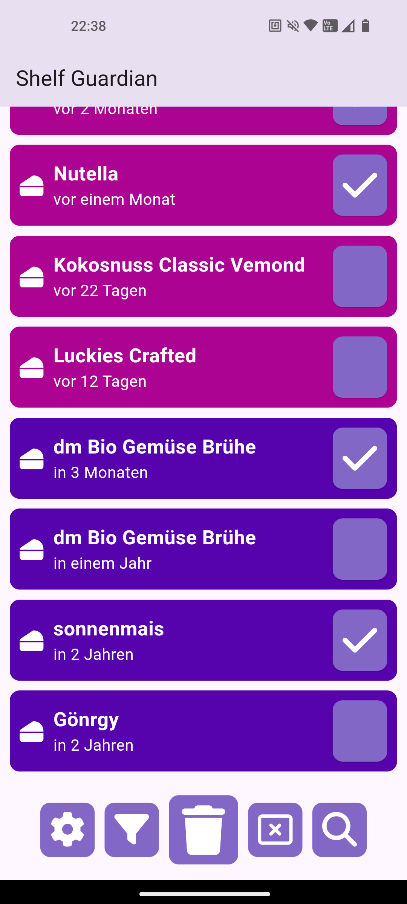
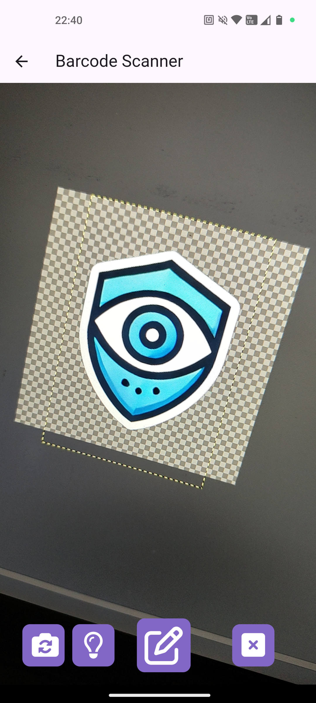
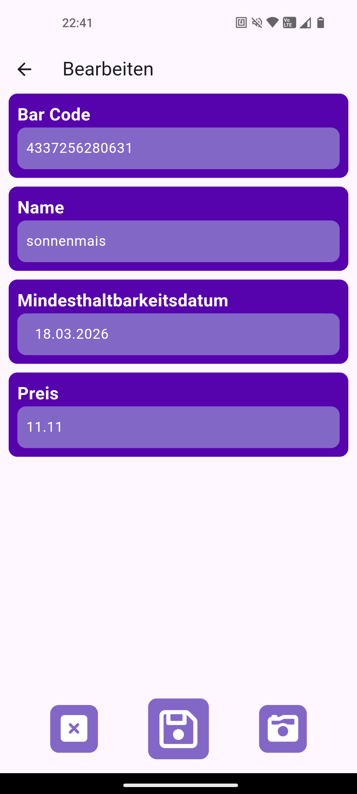

# Shelf Guardian

## Description

Introducing **Shelf Guardian**, your ultimate solution for managing product durability and inventory efficiently. With Shelf Guardian, you can ensure that your products are always fresh and well-managed. Here's what Shelf Guardian offers:

- **Track Minimum Durability Dates**: Monitor your products' expiration dates effortlessly. Shelf Guardian keeps an updated record of all your products' minimum durability dates.
- **Comprehensive Inventory Management**: Easily add, remove, or update product information. Maintain a well-organized and current inventory with just a few clicks.
- **Barcode Recognition**: Speed up your inventory process with our barcode scanning feature. Instantly add products to your inventory by scanning their barcodes.
- **Smart Notifications**: Stay informed with timely notifications on your phone when products are nearing their minimum durability dates. Prevent waste and ensure your products are always fresh.

**Shelf Guardian** – safeguarding your shelves and keeping your products fresh and organized!

## Features

### Authentication

Products are assigned to users, so before anyone can add products, they must create an account and sign in.

- **Sign In Page**: This is the start page when someone opens the app for the first time or if no valid authentication token is stored. Authentication tokens are invalidated once they expire.

  

- **Sign Up Page**: Accessible when the user clicks on "Registrieren." Here, users can create an account, but they must verify it through a verification email from Supabase before using the app.

  

- **Forgot Password Page**: If a user forgets their password, they can recover their account. Supabase will send a recovery email allowing the user to reset their password.

  

### Manage Products

#### Overview of your Products

If you have a valid session, you can view your products. The start page displays all your products, ordered by their expiration dates, with the ones expiring the soonest at the top of the list. If you have no products in your list, it will display `Keine Produkte gefunden`.

From the list, you can select multiple products or just one to remove. To select a product, long-click on it. Once selected, you can select additional products or deselect them with a short click. You can also use the checkbox next to each item to select or deselect it with a short click. Selected items will have a checkmark in their checkbox, while unselected items will have an empty checkbox.

When a product is selected, the action buttons change. The main button in the center becomes the delete button for the selected items. The button to the right allows you to deselect items. If no items are selected, the main button is used to add a new product, and the button on the right is for selecting all products.

- **Nothing is selected** :

  

- **Something is selected**:

  

#### Add a new Product

To add a new Product you have to click on the `+` button in the bottom right corner. This will navigate to `Scanner` page where you can scan the barcode of the product. If the barcode is not recognized, you can manually enter the product information. If the barcode is recognized, the product information will be filled in automatically, and you have only to enter the minimum durability date.

> Recognized barcodes means that the product is already in the database and you name and description is already filled in. If the barcode is not recognized, you have to enter the name and description manually. What you have to enter manually every time is the minimum durability date and price of the product.

After the Scanner you get navigated to the `Create` page where you can enter the minimum durability date. If you have entered all information, you can click on the save button to save the product, but if you want to cancel the process, you can click on the cancel button or scan another barcode.

When you saved your new Product you get navigated back to the `Home` page where you can see your new product in the list. If you have a other device with the same account, the new product will be synchronized to this device, supported by Supabase Realtime Database.

- **Scanner Page**:

  

- **Create Page**:

  

#### Update a Product

To update a product you have to click on the product in the list. This will navigate to the `Update` page where you can update the minimum durability date. If you have entered the new date, you can click on the save button to save the product, but if you want to cancel the process, you can click on the cancel button.

- **Update Page**:

  

### Filter and Searching Products

### Recognize existing Barcode

### Notification

### Synchronization

### Easter Egg

## Technologies

### Dependencies

### Permissions

### Problems during development

## Future
